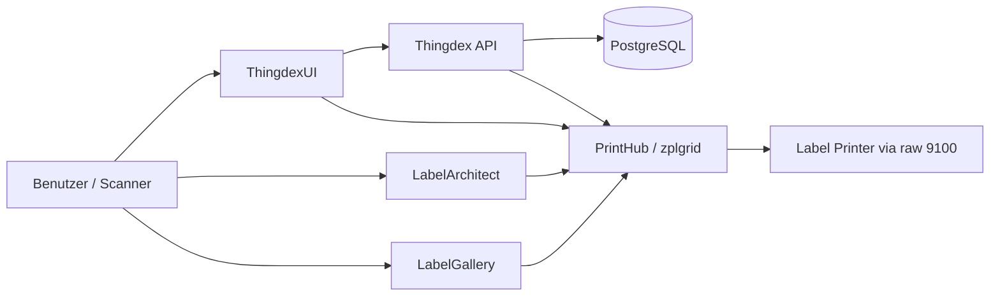

# Thingdex Home Inventory

Zentrales Übersichts- und Architektur-Repository für das **Thingdex Home Inventory**-Ökosystem.

Dieses Repository ist der Einstiegspunkt für das gesamte System. Es beschreibt,

- welche Repositories es gibt,
- welche Rolle jedes Repository hat,
- wie die Services miteinander kommunizieren,
- welche Datenflüsse es gibt,
- und welche APIs an welcher Stelle bereitgestellt werden.

Kurz gesagt: **Thingdex Home Inventory** ist kein einzelnes Programm, sondern ein zusammengesetztes System aus Inventar-Backend, operativem Frontend, Label-Designer, Template-/Operator-UI und einem Druck-/Render-Service für ZPL-II.

---

## Inhalt

- [Was ist das hier?](#was-ist-das-hier)
- [Das System in 60 Sekunden](#das-system-in-60-sekunden)
- [Repository-Übersicht](#repository-übersicht)
- [Architektur](#architektur)
- [Zusammenspiel der Komponenten](#zusammenspiel-der-komponenten)
- [Zentrale Domänenmodelle](#zentrale-domänenmodelle)
- [End-to-End-Workflows](#end-to-end-workflows)
- [Repository-Details](#repository-details)
  - [Thingdex](#thingdex)
  - [ThingdexUI](#thingdexui)
  - [LabelArchitect](#labelarchitect)
  - [LabelGallery](#labelgallery)
  - [PrintHub / zplgrid](#printhub--zplgrid)
- [API-Landkarte](#api-landkarte)
- [Deployment-Idee](#deployment-idee)
- [Ziel dieses Umbrella-Repositories](#ziel-dieses-umbrella-repositories)

---

## Was ist das hier?

Dieses Repository soll die **zentrale Dokumentation** für das gesamte Projekt werden.

Es enthält idealerweise:

- eine verständliche Projektübersicht,
- Links auf alle Teil-Repositories,
- Architekturdiagramme,
- Flows für Inventarisierung und Label-Druck,
- eine API-Landkarte,
- Setup- und Deployment-Hinweise,
- sowie später eventuell zusätzliche High-Level-Dokumentation.

Es ist damit **kein Runtime-Service**, sondern die **Einstiegs- und Überblicksseite** für das ganze System.

---

## Das System in 60 Sekunden

**Thingdex Home Inventory** ist ein modulares, selbst gehostetes System zur Verwaltung von Haushaltsinventar.

Das System trennt dabei bewusst mehrere Verantwortlichkeiten:

1. **Thingdex** verwaltet die eigentlichen Inventardaten.
2. **ThingdexUI** ist das operative Frontend für den Alltag, besonders für Scanner-Workflows.
3. **LabelArchitect** entwirft Etiketten als JSON-Templates.
4. **LabelGallery** zeigt gespeicherte Templates an, verwaltet Printer-Kontext und dient als Operator-/Print-UI.
5. **PrintHub / zplgrid** rendert Template-JSON zu ZPL-II, erzeugt Vorschauen und sendet Druckjobs an Zebra-kompatible Drucker.

Damit entsteht eine saubere Trennung zwischen:

- **Inventardaten**,
- **Bedienoberfläche**,
- **Label-Design**,
- **Template-Verwaltung**,
- und **physischem Druck**.

---

## Repository-Übersicht

| Repository | Rolle |
|---|---|
| [`Thingdex-Home-Inventory`](https://github.com/Hartmannlight/Thingdex-Home-Inventory) | Zentrales Portal, Architektur- und Übersichts-Dokumentation |
| [`Thingdex`](https://github.com/Hartmannlight/Thingdex) | Backend-API für Inventar, Standorte, Typen, Relationen, History und Label-Reprints |
| [`ThingdexUI`](https://github.com/Hartmannlight/ThingdexUI) | Scanner-first Web-Frontend für den operativen Alltag |
| [`LabelArchitect`](https://github.com/Hartmannlight/LabelArchitect) | Visueller Editor für zplgrid-Templates |
| [`LabelGallery`](https://github.com/Hartmannlight/LabelGallery) | Template-Browser, Draft-/Operator-UI und Printer-nahe Print-Oberfläche |
| [`PrintHub-ZPL-ll`](https://github.com/Hartmannlight/PrintHub-ZPL-ll) | ZPL-Render-, Preview-, Template-, Draft- und Print-Service |

---

## Architektur

### High-Level-Sicht



### Architekturprinzip

Das System ist nicht als Monolith gebaut, sondern als lose gekoppeltes Ökosystem.

- **Thingdex** ist das fachliche System of Record für Inventar.
- **ThingdexUI** spricht primär mit Thingdex.
- **LabelArchitect** erzeugt keine ZPL-II-Ausgabe im Browser, sondern nur ein strukturiertes Template-JSON.
- **PrintHub** ist die technische Instanz für Rendering, Preview, Drafts und physisches Drucken.
- **LabelGallery** sitzt näher am Template-/Draft-/Printer-Workflow als am Inventar-Workflow.

Diese Trennung ist wichtig, weil Label-Rendering und Drucklogik andere Anforderungen haben als Inventarverwaltung.

---

## Zusammenspiel der Komponenten

### 1. Inventar

Das Inventar lebt in **Thingdex**.

Dort werden gespeichert:

- Standorte,
- Standort-Hierarchien,
- Item Types,
- konkrete Items,
- Relationen zwischen Items,
- Prop-History,
- Snapshots,
- sowie Metadaten zur Label-Verknüpfung.

### 2. Bedienung im Alltag

**ThingdexUI** ist die tägliche Oberfläche.

Dort passieren typische operative Aufgaben:

- Item anlegen,
- Item scannen,
- Item verschieben,
- Location verschieben,
- Relations anlegen oder lösen,
- Label neu drucken,
- Suche und Lookup.

### 3. Label-Templates entwerfen

**LabelArchitect** ist der Editor für Label-Layouts.

Er erzeugt ein **zplgrid-Template-JSON**. Dieses JSON beschreibt:

- das Layout,
- Text-, QR-, DataMatrix-, Bild- und Linien-Elemente,
- Defaults,
- Variablen,
- und Preview-/Target-Kontext.

Wichtig: Der Editor rendert **nicht selbst final nach ZPL-II**. Das übernimmt später PrintHub.

### 4. Templates speichern und druckbar machen

Die Templates werden in der Regel über **PrintHub** gespeichert.

Dafür existieren APIs wie:

- `POST /v1/templates`
- `PUT /v1/templates/{template_id}`
- `GET /v1/templates`
- `GET /v1/templates/{template_id}`

### 5. Preview und Drafts

Für Vorschau und Übergabe an eine Operator-Oberfläche wird mit **Drafts** gearbeitet.

Ablauf:

1. LabelArchitect erzeugt einen Draft.
2. PrintHub speichert diesen Draft.
3. LabelGallery oder eine Operator-Ansicht lädt den Draft.
4. Von dort aus wird der Druck ausgelöst.

### 6. Physischer Druck

Der physische Druck läuft über **PrintHub**.

PrintHub kann:

- Template + Variablen zu ZPL-II rendern,
- PNG-Preview erzeugen,
- Drucker-Konfiguration verwalten,
- ZPL direkt an einen Drucker schicken,
- oder Template-basierte Druckjobs ausführen.

Der eigentliche Versand an den Drucker erfolgt über eine Zebra-typische Raw-9100-Verbindung.

---

## Zentrale Domänenmodelle

### Locations

Locations beschreiben physische Orte oder Behälter.

Beispiele:

- Haus
- Zimmer
- Regal
- Schrank
- Kiste
- Box
- Fach

Locations bilden einen **Baum mit beliebiger Tiefe**.

### Item Types

Item Types definieren die Struktur eines Gegenstands.

Ein Type beschreibt zum Beispiel:

- welche Felder es gibt,
- welche Felder Pflicht sind,
- welche Datentypen erlaubt sind,
- welche UI-Hinweise verwendet werden,
- und welche Felder historisiert werden sollen.

### Items

Items sind konkrete Objekte im Inventar.

Ein Item hat typischerweise:

- einen `type_id`,
- einen physischen Standort,
- einen `status`,
- eine `description`,
- und ein `props`-Objekt mit typabhängigen Feldern.

### Relations

Relations modellieren Verbindungen zwischen Items.

Beispiele:

- ein Kabel ist in einem Gerät verbaut,
- ein Speichermedium steckt in einem Server,
- ein Adapter gehört zu einem Netzteil.

Dadurch kann ein Item effektiv „in Benutzung“ sein, obwohl es keinen eigenen physischen Lagerort hat.

### Snapshots

Snapshots sind für größere oder versionierte Nutzdaten gedacht, die nicht gut in normale Props passen.

Beispiel:

- Dateisystembaum,
- Scan-Ergebnisse,
- Geräte-Zustandsdaten,
- längere technische Outputs.

### Label-Templates

Label-Templates werden als JSON gespeichert und später in ZPL-II umgewandelt.

Ein Template enthält:

- Layout-Struktur,
- visuelle Elemente,
- Variablen,
- Defaults,
- und Render-Konfiguration.

---

## End-to-End-Workflows

## 1. Neuen Gegenstand inventarisieren

1. In **ThingdexUI** wird ein Item-Type ausgewählt.
2. Ein neues Item wird erstellt.
3. Props werden gegen das Type-Schema validiert.
4. Das Item wird in **Thingdex** gespeichert.
5. Optional wird direkt ein Label gedruckt.

## 2. Gegenstand per Scanner verschieben

1. Scanner liest Item-Code.
2. ThingdexUI lädt das Item.
3. Scanner liest Ziel-Location.
4. ThingdexUI ruft den Move-Endpoint in Thingdex auf.
5. Der neue effektive Pfad ergibt sich automatisch aus dem Location-Baum.

## 3. Neues Label-Template entwerfen

1. In **LabelArchitect** wird ein neues Layout gebaut.
2. Variablen wie `{name}` oder `{internal_uuid}` werden definiert.
3. Das Template wird als JSON gespeichert.
4. Das Template wird über PrintHub in die Template-Library geschrieben.
5. Optional wird eine Preview erzeugt.

## 4. Label drucken

1. Eine UI lädt ein Template.
2. Variablen werden ausgefüllt.
3. PrintHub rendert das Template zu ZPL-II.
4. Optional wird vorab eine PNG-Preview erzeugt.
5. PrintHub sendet den Job an einen konfigurierten Drucker.

## 5. Label-Reprint aus Thingdex

1. Ein Item oder eine Location besitzt eine Template-Zuordnung.
2. ThingdexUI ruft `POST /v1/labels/print` auf.
3. Thingdex holt das Template und baut die benötigten Variablen.
4. PrintHub druckt das Label erneut.

---

## Repository-Details

## Thingdex

### Rolle

**Thingdex** ist das Kern-Backend für das Inventarsystem.

Es basiert auf:

- **FastAPI**
- **PostgreSQL**
- **SQLAlchemy**
- **Alembic**

### Wofür Thingdex zuständig ist

- Verwaltung der Location-Hierarchie
- Definition von Item Types
- CRUD für Items
- Bulk-Operationen auf Items
- Relations zwischen Items
- Prop-History
- Snapshots
- Suche
- Health-Check
- optionaler Label-Reprint
- Validierung von Label-Templates gegen Item-Type-Schemas

### Wichtige Konfiguration

- `DATABASE_URL`
- `ROOT_LOCATION_NAME`
- `LABEL_PRINTING_ENABLED`
- `LABEL_API_BASE`
- `PRINTHUB_API_BASE`
- `LABEL_CONTAINER_TEMPLATE_ID`

### API-Gruppen

#### Health

- `GET /health`

#### Locations

- `POST /v1/locations`
- `GET /v1/locations/root`
- `GET /v1/locations/tree`
- `GET /v1/locations/{location_id}`
- `PATCH /v1/locations/{location_id}`
- `GET /v1/locations/{location_id}/children`
- `GET /v1/locations/{location_id}/path`
- `GET /v1/locations/{location_id}/items`
- `DELETE /v1/locations/{location_id}`

#### Item Types

- `POST /v1/item-types`
- `GET /v1/item-types`
- `GET /v1/item-types/{item_type_id}`
- `PATCH /v1/item-types/{item_type_id}`
- `DELETE /v1/item-types/{item_type_id}`

#### Items

- `POST /v1/items`
- `POST /v1/items/bulk`
- `PATCH /v1/items/bulk`
- `PATCH /v1/items/bulk/move`
- `GET /v1/items`
- `GET /v1/items/missing-location`
- `GET /v1/items/{item_id}`
- `PATCH /v1/items/{item_id}`
- `PATCH /v1/items/{item_id}/move`
- `PATCH /v1/items/{item_id}/props`
- `PUT /v1/items/{item_id}/props`
- `POST /v1/items/{item_id}/relations`
- `GET /v1/items/{item_id}/relations/children`
- `GET /v1/items/{item_id}/relations/parents`
- `GET /v1/items/{item_id}/history`
- `POST /v1/items/{item_id}/snapshots`
- `GET /v1/items/{item_id}/snapshots`
- `DELETE /v1/items/{item_id}/snapshots/{snapshot_id}`
- `DELETE /v1/items/{item_id}`
- `POST /v1/items/search`

#### Relations

- `PATCH /v1/relations/{relation_id}`
- `POST /v1/relations/{relation_id}/detach`
- `DELETE /v1/relations/{relation_id}`

#### Labels

- `POST /v1/labels/print`

### Besondere fachliche Punkte

#### Root-Location

Die Root-Location wird nicht zwingend manuell vorab angelegt. Sie kann automatisch über `GET /v1/locations/root` gebootstrapped werden.

#### Schema-getriebene Props

Thingdex verwendet keine klassische, starre Tabellenstruktur pro Objekttyp. Stattdessen definiert ein Item Type sein eigenes Schema, und Items speichern ihre typabhängigen Felder in `props`.

#### History und Snapshots

Kleine, strukturierte Zustandsänderungen laufen über Props und History.

Größere oder versionierte Daten laufen über Snapshots.

#### Label-Kopplung

Thingdex ist nicht nur Inventar-API, sondern bereits fachlich mit dem Label-System verzahnt:

- `label_template_id` kann an Item Types hängen,
- Location-Labels können über `location.meta.label_template_id` gesteuert werden,
- beim Erstellen von Items oder Locations kann optional direkt ein Druck ausgelöst werden,
- und Reprints laufen über `POST /v1/labels/print`.

---

## ThingdexUI

### Rolle

**ThingdexUI** ist das operative Frontend.

Es ist auf schnelle, scannerfreundliche Interaktionen ausgelegt.

### Hauptziele

- schnelle Barcode-/QR-gestützte Datenerfassung
- klarer Fokus auf operative Standardaufgaben
- starke Keyboard-Flow-Orientierung
- einfache Reprint- und Move-Workflows

### Typische Aufgaben in der UI

- Items erstellen
- Items verschieben
- Locations verschieben
- Relationen anlegen oder lösen
- Label-Reprints auslösen
- Suche und UUID-Lookups

### Technische Rolle

ThingdexUI ist primär Client der Thingdex-API, kennt aber zusätzlich Konfigurationen für:

- Label-Service-Basis-URL
- Printer-Hub-Basis-URL
- Root-Location-Voreinstellungen
- Feature-Flags
- Audio-/Feedback-Verhalten

### Wichtige Beobachtung

ThingdexUI ist keine allgemeine Management-Oberfläche für das komplette Ökosystem, sondern eine **Arbeitsoberfläche für den Alltag**.

Der Fokus liegt klar auf:

- Inventarisieren,
- Bewegen,
- Scannen,
- Nachschlagen,
- Reprinten.

---

## LabelArchitect

### Rolle

**LabelArchitect** ist der grafische Editor für Label-Templates.

### Was der Editor liefert

- Split-Layout-Editor
- Leaf-basierte Layoutstruktur
- Elemente: Text, QR, DataMatrix, Image, Line
- Properties-Panel
- Defaults-Handling
- Import/Export von JSON
- Variablen-Erkennung
- Undo/Redo
- Zod-Validierung
- Draft-Handoff in eine Operator-UI

### Wichtige Abgrenzung

LabelArchitect erzeugt **kein finales ZPL-II im Browser**.

Er erzeugt ein **Template-JSON**, das anschließend von PrintHub gerendert wird.

### Erwartete Backend-Endpunkte

LabelArchitect arbeitet gegen ein Backend mit mindestens diesen Routen:

- `GET /v1/templates`
- `GET /v1/templates/{id}`
- `POST /v1/templates`
- `PUT /v1/templates/{id}`
- `GET /v1/templates/{id}/preview`
- `POST /v1/renders/zpl`
- `POST /v1/drafts`

### Bedeutung im Gesamtsystem

LabelArchitect ist der **Authoring-Teil** des Label-Systems.

Dort werden Layouts modelliert. Alles, was mit Rendern, Draft-Speicherung, Preview und physischem Druck zu tun hat, gehört dagegen in PrintHub und in die daran anschließenden UIs.

---

## LabelGallery

### Rolle

**LabelGallery** ist deutlich mehr als nur eine Galerie für gespeicherte Templates.

Es ist faktisch eine Mischung aus:

- Template-Browser,
- Draft-Ansicht,
- Operator-/Print-UI,
- und printer-naher Verwaltungsoberfläche.

### Was die App praktisch tut

Aus der App-Logik lässt sich ablesen, dass LabelGallery mit folgenden Konzepten arbeitet:

- Template-Liste
- Template-Details
- Variable-Eingabe
- Printer-Auswahl
- Draft-Modus
- Draft-Preview
- Druckauslösung
- Printer-Refresh / Printer-Metadaten
- Drucker-Konfigurationen

### Typische API-Nutzung

LabelGallery arbeitet gegen PrintHub-nahe Endpunkte wie:

- `GET /v1/templates`
- `GET /v1/templates/{template_id}`
- `GET /v1/drafts/{draft_id}`
- `POST /v1/renders/png`
- `GET /v1/printers`
- `POST /v1/printers/{printer_id}/prints/template`

### Printer-Kontext

Die Printer-Konfiguration umfasst unter anderem:

- `id`
- `name`
- `model`
- `vendor`
- `driver`
- `connection`
- `media`
- `alignment`
- `zpl`
- `defaults`
- `capabilities`
- `enabled`

Damit ist LabelGallery die Oberfläche, die dem eigentlichen Druckbetrieb am nächsten ist.

### Wichtige Abgrenzung

LabelGallery ist **nicht** das Inventar-Frontend.

Es ist die UI rund um:

- Templates,
- Printer,
- Drafts,
- Preview,
- und konkrete Druckausführung.

---

## PrintHub / zplgrid

### Rolle

**PrintHub** ist der technische Render- und Druckdienst.

Im Repository ist er als **zplgrid** beschrieben.

### Kernaufgaben

- JSON-Templates zu ZPL-II kompilieren
- PNG-Vorschau erzeugen
- Templates speichern
- Drafts speichern und abrufen
- Drucker auflisten und verwalten
- Druckjobs an Drucker senden
- Druckerstatus liefern

### API-Gruppen

#### Render

- `POST /v1/renders/zpl`
- `POST /v1/renders/png`

#### Drafts

- `POST /v1/drafts`
- `GET /v1/drafts/{draft_id}`

#### Templates

- `POST /v1/templates`
- `PUT /v1/templates/{template_id}`
- `GET /v1/templates`
- `GET /v1/templates/{template_id}`
- `GET /v1/templates/{template_id}/preview`

#### Printers / Printing

- `POST /v1/printers/{printer_id}/prints/zpl`
- `POST /v1/printers/{printer_id}/prints/template`
- `GET /v1/printers`
- `GET /v1/printers/{printer_id}`
- `PUT /v1/printers/{printer_id}`
- `GET /v1/printers/{printer_id}/status`

### Drucker-Modell

PrintHub verwaltet Drucker explizit als konfigurierte Ressourcen.

Ein Drucker hat mindestens:

- Verbindungsdaten
- Media-Informationen
- Alignment-Daten
- ZPL-Druckparameter
- Defaults
- Capabilities

### Warum dieser Service getrennt ist

Das ist eine sehr gute Trennung, weil PrintHub Dinge kapselt, die im Inventar-Backend nichts verloren haben:

- Template-Rendering
- Labelary-Integration
- Drucker-Protokollierung
- physischer Druck über Netzwerk
- Template-Storage
- Draft-Lebenszyklen

---

## API-Landkarte

## Welche API gehört zu welchem Repo?

| Repo | API-Verantwortung |
|---|---|
| Thingdex | Inventar, Locations, Item Types, Items, Relations, History, Snapshots, Label-Reprints |
| ThingdexUI | kein eigenes Kern-Backend; konsumiert primär Thingdex |
| LabelArchitect | kein eigentlicher Render-Service; konsumiert Template-/Render-/Draft-Endpunkte |
| LabelGallery | kein eigener Kern-Backend-Service; konsumiert Template-, Draft-, Preview- und Printer-Endpunkte |
| PrintHub / zplgrid | Render, Preview, Templates, Drafts, Printers, physischer Druck |

## Fachliche Zuordnung

| Bereich | Zuständiges Repo |
|---|---|
| Inventardaten | Thingdex |
| Operative Inventar-UI | ThingdexUI |
| Label-Layout-Authoring | LabelArchitect |
| Template-/Draft-/Printer-UI | LabelGallery |
| ZPL-II-Rendering und Druck | PrintHub / zplgrid |

---

## Deployment-Idee

Eine sinnvolle Ziel-Topologie könnte so aussehen:

```text
Reverse Proxy
├── inventory.example.local        -> ThingdexUI
├── api.inventory.example.local    -> Thingdex
├── labels.example.local           -> LabelArchitect
├── print.example.local            -> LabelGallery
└── render.example.local           -> PrintHub / zplgrid
```

Zusätzlich:

```text
Thingdex -> PostgreSQL
Thingdex -> PrintHub
ThingdexUI -> Thingdex
LabelArchitect -> PrintHub
LabelGallery -> PrintHub
PrintHub -> Label Printer (TCP 9100)
```

Je nach Setup können einzelne UIs natürlich auch unter einem gemeinsamen Host oder Pfad betrieben werden.

---

## Ziel dieses Umbrella-Repositories

Dieses Repository sollte langfristig die Antwort auf diese Fragen geben:

- Was ist Thingdex Home Inventory überhaupt?
- Welches Repo ist für was zuständig?
- Wo beginne ich als Entwickler?
- Wo beginne ich als Nutzer?
- Welche API muss ich für welchen Anwendungsfall ansprechen?
- Wie läuft der Druck-Workflow technisch ab?
- Wie hängt Inventar mit Labels zusammen?

### Was hier später zusätzlich sinnvoll wäre

- ein Architekturdiagramm pro Subsystem
- ein Datenmodell-Abschnitt mit Beispielobjekten
- konkrete Setup-Guides
- Entwicklungs-Workflows pro Repo
- Beispiel-Requests für die wichtigsten APIs
- Beispiel eines vollständigen Label-Lebenszyklus
- Namenskonventionen für Templates, Printer und Item Types
- Security- und Auth-Überlegungen
- Backup-/Restore-Dokumentation

---

## Zusammenfassung

**Thingdex Home Inventory** besteht aus klar getrennten, aber eng zusammenarbeitenden Bausteinen:

- **Thingdex** speichert und verwaltet Inventardaten.
- **ThingdexUI** ist die operative Inventar-Oberfläche.
- **LabelArchitect** entwirft Templates.
- **LabelGallery** bedient Template-/Draft-/Printer-nahe Workflows.
- **PrintHub** rendert, previewt und druckt Labels.

Gerade diese Aufteilung macht das System stark:

- Inventar bleibt fachlich sauber,
- Labeling bleibt technisch flexibel,
- und Drucklogik bleibt austauschbar und separat betreibbar.

