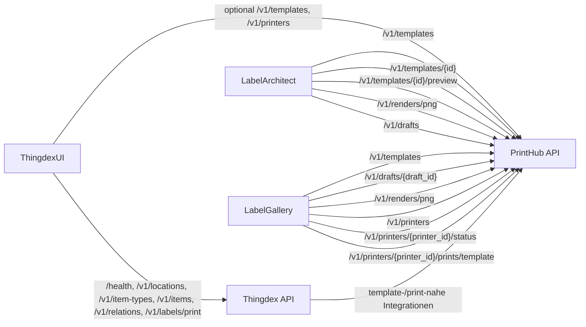
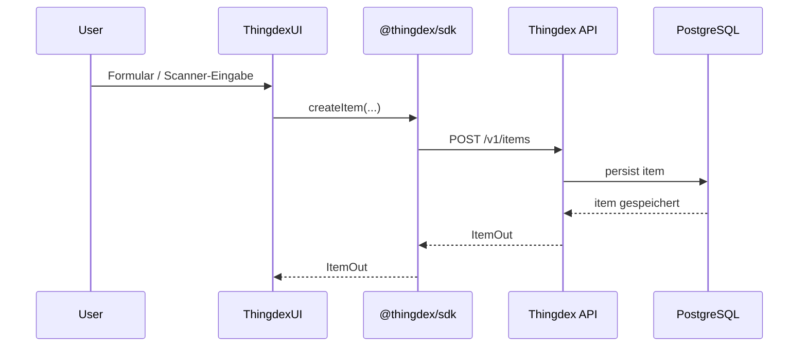
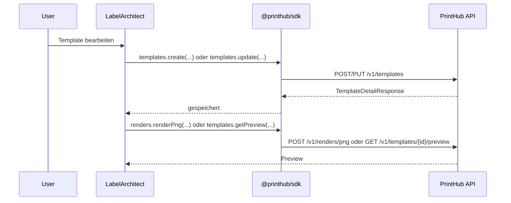
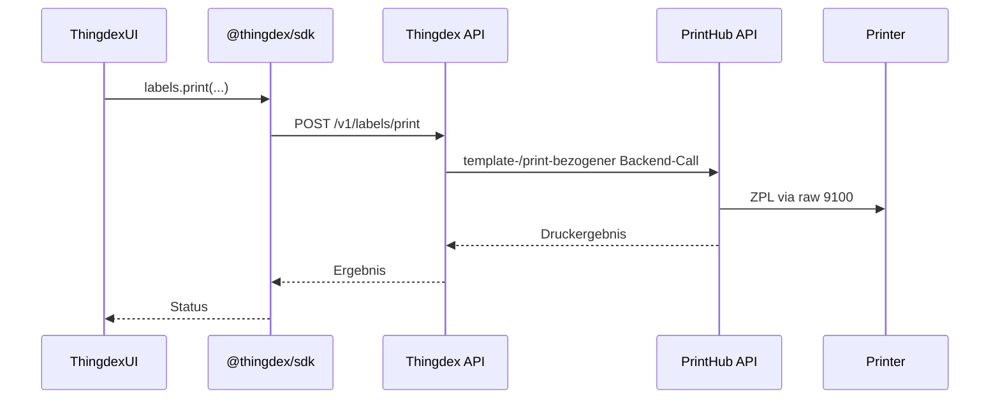

# Thingdex Home Inventory

> **Rewrite note:** LabelArchitect and LabelGallery are being consolidated into
> **PrintHub Studio**. The canonical target architecture and migration steps are
> documented in [`PRINTHUB_REWRITE_PLAN.md`](PRINTHUB_REWRITE_PLAN.md). Sections
> below that describe both legacy UIs separately are retained as migration
> history.

> **Current platform boundary:** PrintHub now owns document preparation and
> logical jobs; PrinterFleet owns physical printers and direct RAW-9100 or
> PrintAgent delivery. Thingdex commits requested prints to a transactional
> outbox and a separate worker submits them. Older diagrams below that show
> PrintHub talking directly to printers are migration history.

Zentrales Uebersichts- und Architektur-Repository fuer das **Thingdex Home Inventory**-Oekosystem.

Dieses Repository ist der Einstiegspunkt fuer das gesamte System. Es beschreibt,

- welche Repositories es gibt,
- welche Rolle jedes Repository hat,
- wie die Services miteinander kommunizieren,
- welche Datenfluesse es gibt,
- welche APIs an welcher Stelle bereitgestellt werden,
- und wie die heutige contract-based Architektur mit OpenAPI und SDKs funktioniert.

Kurz gesagt: **Thingdex Home Inventory** ist kein einzelnes Programm, sondern ein zusammengesetztes System aus Inventar-Backend, operativem Frontend, Label-Designer, Template-/Operator-UI und einem Druck-/Render-Service fuer ZPL-II.

---

## Inhalt

- [Was ist das hier?](#was-ist-das-hier)
- [Das System in 60 Sekunden](#das-system-in-60-sekunden)
- [Repository-Uebersicht](#repository-uebersicht)
- [Architektur](#architektur)
- [Zusammenspiel der Komponenten](#zusammenspiel-der-komponenten)
- [Zentrale Domaenenmodelle](#zentrale-domaenenmodelle)
- [End-to-End-Workflows](#end-to-end-workflows)
- [Repository-Details](#repository-details)
  - [Thingdex](#thingdex)
  - [ThingdexUI](#thingdexui)
  - [LabelArchitect](#labelarchitect)
  - [LabelGallery](#labelgallery)
  - [PrintHub / zplgrid](#printhub--zplgrid)
  - [thingdex-sdk](#thingdex-sdk)
  - [printhub-sdk](#printhub-sdk)
- [API-Landkarte](#api-landkarte)
- [Lokaler Workspace](#lokaler-workspace)
- [Entwicklungsworkflow](#entwicklungsworkflow)
- [Deployment-Idee](#deployment-idee)
- [Ziel dieses Umbrella-Repositories](#ziel-dieses-umbrella-repositories)

---

## Was ist das hier?

Dieses Repository soll die **zentrale Dokumentation** fuer das gesamte Projekt sein.

Es enthaelt idealerweise:

- eine verstaendliche Projektuebersicht,
- Links auf alle Teil-Repositories,
- Architekturdiagramme,
- Flows fuer Inventarisierung und Label-Druck,
- eine API-Landkarte,
- Setup- und Deployment-Hinweise,
- sowie zusaetzliche High-Level-Dokumentation.

Es ist damit **kein Runtime-Service**, sondern die **Einstiegs- und Ueberblicksseite** fuer das ganze System.

---

## Das System in 60 Sekunden

**Thingdex Home Inventory** ist ein modulares, selbst gehostetes System zur Verwaltung von Haushaltsinventar.

Das System trennt dabei bewusst mehrere Verantwortlichkeiten:

1. **Thingdex** verwaltet die eigentlichen Inventardaten.
2. **ThingdexUI** ist das operative Frontend fuer den Alltag, besonders fuer Scanner-Workflows.
3. **LabelArchitect** entwirft Etiketten als JSON-Templates.
4. **LabelGallery** zeigt gespeicherte Templates an, verwaltet Printer-Kontext und dient als Operator-/Print-UI.
5. **PrintHub / zplgrid** rendert Template-JSON zu ZPL-II, erzeugt Vorschauen und sendet Druckjobs an Zebra-kompatible Drucker.
6. **thingdex-sdk** und **printhub-sdk** bilden die API-Contracts als konsumierbare Client-Layer fuer die Frontends ab.

Damit entsteht eine saubere Trennung zwischen:

- **Inventardaten**,
- **Bedienoberflaeche**,
- **Label-Design**,
- **Template-Verwaltung**,
- **API-Contracts**,
- und **physischem Druck**.

---

## Repository-Uebersicht

| Repository | Rolle |
|---|---|
| [`Thingdex-Home-Inventory`](https://github.com/Hartmannlight/Thingdex-Home-Inventory) | Zentrales Portal, Architektur- und Uebersichts-Dokumentation |
| [`Thingdex`](https://github.com/Hartmannlight/Thingdex) | Backend-API fuer Inventar, Standorte, Typen, Relationen, History und Label-Reprints |
| [`ThingdexUI`](https://github.com/Hartmannlight/ThingdexUI) | Scanner-first Web-Frontend fuer den operativen Alltag |
| [`LabelArchitect`](https://github.com/Hartmannlight/LabelArchitect) | Visueller Editor fuer zplgrid-Templates |
| [`LabelGallery`](https://github.com/Hartmannlight/LabelGallery) | Template-Browser, Draft-/Operator-UI und Printer-nahe Print-Oberflaeche |
| [`PrintHub-ZPL-ll`](https://github.com/Hartmannlight/PrintHub-ZPL-ll) | ZPL-Render-, Preview-, Template-, Draft- und Print-Service |
| [`ZPL-II-Printer-Emulator`](https://github.com/Hartmannlight/ZPL-II-Printer-Emulator) | Virtueller ZPL-II-Dev-Drucker mit Raw-9100-Empfang und Web-Preview |
| `thingdex-sdk` | Lokales TypeScript-SDK fuer den Thingdex-OpenAPI-Contract |
| `printhub-sdk` | Lokales TypeScript-SDK fuer den PrintHub-OpenAPI-Contract |

---

## Architektur

### High-Level-Sicht

```mermaid
flowchart LR
    User[Benutzer / Scanner] --> UI[ThingdexUI]
    User --> LA[LabelArchitect]
    User --> LG[LabelGallery]

    UI --> TSDK[@thingdex/sdk]
    UI --> PSDK1[@printhub/sdk]
    LA --> PSDK2[@printhub/sdk]
    LG --> PSDK3[@printhub/sdk]

    TSDK --> TD[Thingdex API]
    PSDK1 --> PH[PrintHub / zplgrid]
    PSDK2 --> PH
    PSDK3 --> PH

    TD --> DB[(PostgreSQL)]
    TD --> PH
    PH --> PR[Label Printer via raw 9100]
    PH --> VPR[ZPL-II Printer Emulator via raw 9100]
```

### Contract-basierte Zugriffsschicht

Die Architektur ist heute nicht mehr nur eine lose Kopplung von Frontend zu Backend, sondern eine **contract-based Architektur**.

Das bedeutet:

- jedes Backend definiert seine API ueber OpenAPI,
- der OpenAPI-Contract wird exportiert,
- daraus wird ein SDK generiert,
- und Frontends konsumieren vorzugsweise diese SDKs statt eigene rohe Fetch-Layer zu pflegen.

```mermaid
flowchart TB
    subgraph ThingdexPfad[Thingdex-Vertrag]
        TDCode[Thingdex Backend-Code]
        TDOA[Thingdex OpenAPI]
        TSDK[@thingdex/sdk]
        TUI[ThingdexUI]
        TDCode --> TDOA --> TSDK --> TUI
    end

    subgraph PrintHubPfad[PrintHub-Vertrag]
        PHCode[PrintHub Backend-Code]
        PHOA[PrintHub OpenAPI]
        PSDK[@printhub/sdk]
        LA[LabelArchitect]
        LG[LabelGallery]
        TUI2[ThingdexUI optionale PrintHub-Zugriffe]
        PHCode --> PHOA --> PSDK
        PSDK --> LA
        PSDK --> LG
        PSDK --> TUI2
    end
```

### Wer greift auf welche Endpunkte zu?



### Architekturprinzip

Das System ist nicht als Monolith gebaut, sondern als lose gekoppeltes Oekosystem mit klar getrennten Verantwortlichkeiten.

- **Thingdex** ist das fachliche System of Record fuer Inventar.
- **ThingdexUI** spricht primaer mit Thingdex und nur fuer zusaetzliche label-nahe Funktionen optional mit PrintHub.
- **LabelArchitect** erzeugt keine finale ZPL-II-Ausgabe im Browser, sondern nur ein strukturiertes Template-JSON und nutzt PrintHub fuer Preview, Template-Speicherung und Drafts.
- **PrintHub** ist die technische Instanz fuer Rendering, Preview, Drafts und physisches Drucken.
- **LabelGallery** sitzt naeher am Template-/Draft-/Printer-Workflow als am Inventar-Workflow.
- **SDKs** entkoppeln Frontends von konkreten Backend-Implementierungsdetails und stabilisieren die Vertragsgrenzen.

Diese Trennung ist wichtig, weil Label-Rendering und Drucklogik andere Anforderungen haben als Inventarverwaltung und weil sich APIs kontrollierter weiterentwickeln lassen, wenn der Contract explizit versionierbar ist.

---

## Zusammenspiel der Komponenten

### 1. Inventar

Das Inventar lebt in **Thingdex**.

Dort werden gespeichert:

- Standorte,
- Standort-Hierarchien,
- Item Types,
- konkrete Items,
- Relationen zwischen Items,
- Prop-History,
- Snapshots,
- sowie Metadaten zur Label-Verknuepfung.

### 2. Bedienung im Alltag

**ThingdexUI** ist die taegliche Oberflaeche.

Dort passieren typische operative Aufgaben:

- Item anlegen,
- Item scannen,
- Item verschieben,
- Location verschieben,
- Relations anlegen oder loesen,
- Label neu drucken,
- Suche und Lookup.

Wichtig ist heute:

- ThingdexUI spricht nicht mehr nur fachlich mit Thingdex,
- sondern technisch ueber `@thingdex/sdk`,
- und fuer bestimmte label-nahe Informationen optional ueber `@printhub/sdk`.

### 3. Label-Templates entwerfen

**LabelArchitect** ist der Editor fuer Label-Layouts.

Er erzeugt ein **zplgrid-Template-JSON**. Dieses JSON beschreibt:

- das Layout,
- Text-, QR-, DataMatrix-, Bild- und Linien-Elemente,
- Defaults,
- Variablen,
- und Preview-/Target-Kontext.

Wichtig:

- der Editor rendert **nicht selbst final nach ZPL-II**,
- und erzeugt idealerweise auch keine eigene parallele Backend-Typwelt,
- sondern uebergibt an PrintHub und konsumiert dessen API ueber `@printhub/sdk`.

### 4. Templates speichern und druckbar machen

Die Templates werden in der Regel ueber **PrintHub** gespeichert.

Dafuer existieren APIs wie:

- `POST /v1/templates`
- `PUT /v1/templates/{template_id}`
- `GET /v1/templates`
- `GET /v1/templates/{template_id}`

Diese Endpunkte werden heute nicht nur fachlich, sondern auch vertraglich ueber `printhub-sdk` abgebildet.

### 5. Preview und Drafts

Fuer Vorschau und Uebergabe an eine Operator-Oberflaeche wird mit **Drafts** gearbeitet.

Ablauf:

1. LabelArchitect erzeugt einen Draft.
2. PrintHub speichert diesen Draft.
3. LabelGallery oder eine Operator-Ansicht laedt den Draft.
4. Von dort aus wird der Druck ausgeloest oder vorbereitet.

Auch Preview und Drafts sind heute Teil des PrintHub-Contracts.

### 6. Physischer Druck

Der physische Druck laeuft ueber **PrintHub**.

PrintHub kann:

- Template + Variablen zu ZPL-II rendern,
- PNG-Preview erzeugen,
- Drucker-Konfiguration verwalten,
- ZPL direkt an einen Drucker schicken,
- oder template-basierte Druckjobs ausfuehren.

Der eigentliche Versand an den Drucker erfolgt ueber eine Zebra-typische Raw-9100-Verbindung.
Im Docker-Dev-Stack ist dafuer standardmaessig der virtuelle Drucker
`virtual-zpl-dev` konfiguriert. PrintHub sendet dann an den Service
`zpl-printer-emulator:9100`; dessen Weboberflaeche zeigt die gerenderten Labels
unter `http://localhost:9191`.

### 7. API-Contract als technische Trennschicht

Neben der fachlichen Trennung gibt es jetzt eine technische Trennschicht:

- `Thingdex` exportiert OpenAPI und speist `thingdex-sdk`
- `PrintHub` exportiert OpenAPI und speist `printhub-sdk`
- Consumer sollen den Contract konsumieren statt DTOs und Fetch-Logik zu duplizieren

Das reduziert:

- doppelte Typdefinitionen,
- inkonsistente DTOs,
- rohe Backend-Abhaengigkeiten,
- und stilles Auseinanderlaufen von Frontend und Backend.

---

## Zentrale Domaenenmodelle

### Locations

Locations beschreiben physische Orte oder Behaelter.

Beispiele:

- Haus
- Zimmer
- Regal
- Schrank
- Kiste
- Box
- Fach

Locations bilden einen **Baum mit beliebiger Tiefe**.

### Item Types

Item Types definieren die Struktur eines Gegenstands.

Ein Type beschreibt zum Beispiel:

- welche Felder es gibt,
- welche Felder Pflicht sind,
- welche Datentypen erlaubt sind,
- welche UI-Hinweise verwendet werden,
- und welche Felder historisiert werden sollen.

### Items

Items sind konkrete Objekte im Inventar.

Ein Item hat typischerweise:

- einen `type_id`,
- einen physischen Standort,
- einen `status`,
- eine `description`,
- und ein `props`-Objekt mit typabhaengigen Feldern.

### Relations

Relations modellieren Verbindungen zwischen Items.

Beispiele:

- ein Kabel ist in einem Geraet verbaut,
- ein Speichermedium steckt in einem Server,
- ein Adapter gehoert zu einem Netzteil.

Dadurch kann ein Item effektiv "in Benutzung" sein, obwohl es keinen eigenen physischen Lagerort hat.

### Snapshots

Snapshots sind fuer groessere oder versionierte Nutzdaten gedacht, die nicht gut in normale Props passen.

Beispiel:

- Dateisystembaum,
- Scan-Ergebnisse,
- Geraete-Zustandsdaten,
- laengere technische Outputs.

### Label-Templates

Label-Templates werden als JSON gespeichert und spaeter in ZPL-II umgewandelt.

Ein Template enthaelt:

- Layout-Struktur,
- visuelle Elemente,
- Variablen,
- Defaults,
- und Render-Konfiguration.

### API-Contracts

Zusatzlich gibt es inzwischen ein technisches Modell, das im alten Stand der Architektur noch nicht so explizit verankert war:

- OpenAPI-Documents fuer Thingdex und PrintHub
- daraus generierte Typen
- Wrapper-Clients fuer Consumer

Diese Contracts sind keine Fachobjekte wie Items oder Templates, aber sie sind inzwischen ein zentraler Bestandteil der Systemarchitektur.

---

## End-to-End-Workflows

## 1. Neuen Gegenstand inventarisieren

1. In **ThingdexUI** wird ein Item-Type ausgewaehlt.
2. Ein neues Item wird erstellt.
3. Props werden gegen das Type-Schema validiert.
4. Das Item wird in **Thingdex** gespeichert.
5. Optional wird direkt ein Label gedruckt.

### Technischer Pfad



## 2. Gegenstand per Scanner verschieben

1. Scanner liest Item-Code.
2. ThingdexUI laedt das Item.
3. Scanner liest Ziel-Location.
4. ThingdexUI ruft den Move-Endpoint in Thingdex auf.
5. Der neue effektive Pfad ergibt sich automatisch aus dem Location-Baum.

## 3. Neues Label-Template entwerfen

1. In **LabelArchitect** wird ein neues Layout gebaut.
2. Variablen wie `{name}` oder `{internal_uuid}` werden definiert.
3. Das Template wird als JSON gespeichert.
4. Das Template wird ueber PrintHub in die Template-Library geschrieben.
5. Optional wird eine Preview erzeugt.

### Technischer Pfad



## 4. Label drucken

1. Eine UI laedt ein Template.
2. Variablen werden ausgefuellt.
3. PrintHub rendert das Template zu ZPL-II.
4. Optional wird vorab eine PNG-Preview erzeugt.
5. PrintHub sendet den Job an einen konfigurierten Drucker.

## 5. Label-Reprint aus Thingdex

1. Ein Item oder eine Location besitzt eine Template-Zuordnung.
2. ThingdexUI ruft `POST /v1/labels/print` auf.
3. Thingdex holt das Template und baut die benoetigten Variablen.
4. PrintHub druckt das Label erneut.

### Technischer Pfad



---

## Repository-Details

## Thingdex

### Rolle

**Thingdex** ist das Kern-Backend fuer das Inventarsystem.

Es basiert auf:

- **FastAPI**
- **PostgreSQL**
- **SQLAlchemy**
- **Alembic**

### Wofuer Thingdex zustaendig ist

- Verwaltung der Location-Hierarchie
- Definition von Item Types
- CRUD fuer Items
- Bulk-Operationen auf Items
- Relations zwischen Items
- Prop-History
- Snapshots
- Suche
- Health-Check
- optionaler Label-Reprint
- Validierung von Label-Templates gegen Item-Type-Schemas

### Wichtige Konfiguration

- `DATABASE_URL`
- `ROOT_LOCATION_NAME`
- `LABEL_PRINTING_ENABLED`
- `LABEL_API_BASE`
- `PRINTHUB_API_BASE`
- `LABEL_CONTAINER_TEMPLATE_ID`

### API-Gruppen

#### Health

- `GET /health`

#### Locations

- `POST /v1/locations`
- `GET /v1/locations/root`
- `GET /v1/locations/tree`
- `GET /v1/locations/{location_id}`
- `PATCH /v1/locations/{location_id}`
- `GET /v1/locations/{location_id}/children`
- `GET /v1/locations/{location_id}/path`
- `GET /v1/locations/{location_id}/items`
- `DELETE /v1/locations/{location_id}`

#### Item Types

- `POST /v1/item-types`
- `GET /v1/item-types`
- `GET /v1/item-types/{item_type_id}`
- `PATCH /v1/item-types/{item_type_id}`
- `DELETE /v1/item-types/{item_type_id}`

#### Items

- `POST /v1/items`
- `POST /v1/items/bulk`
- `PATCH /v1/items/bulk`
- `PATCH /v1/items/bulk/move`
- `GET /v1/items`
- `GET /v1/items/missing-location`
- `GET /v1/items/{item_id}`
- `PATCH /v1/items/{item_id}`
- `PATCH /v1/items/{item_id}/move`
- `PATCH /v1/items/{item_id}/props`
- `PUT /v1/items/{item_id}/props`
- `POST /v1/items/{item_id}/relations`
- `GET /v1/items/{item_id}/relations/children`
- `GET /v1/items/{item_id}/relations/parents`
- `GET /v1/items/{item_id}/history`
- `POST /v1/items/{item_id}/snapshots`
- `GET /v1/items/{item_id}/snapshots`
- `DELETE /v1/items/{item_id}/snapshots/{snapshot_id}`
- `DELETE /v1/items/{item_id}`
- `POST /v1/items/search`

#### Relations

- `PATCH /v1/relations/{relation_id}`
- `POST /v1/relations/{relation_id}/detach`
- `DELETE /v1/relations/{relation_id}`

#### Labels

- `POST /v1/labels/print`

### Besondere fachliche Punkte

#### Root-Location

Die Root-Location wird nicht zwingend manuell vorab angelegt. Sie kann automatisch ueber `GET /v1/locations/root` gebootstrapped werden.

#### Schema-getriebene Props

Thingdex verwendet keine klassische, starre Tabellenstruktur pro Objekttyp. Stattdessen definiert ein Item Type sein eigenes Schema, und Items speichern ihre typabhaengigen Felder in `props`.

#### History und Snapshots

Kleine, strukturierte Zustandsaenderungen laufen ueber Props und History.

Groessere oder versionierte Daten laufen ueber Snapshots.

#### Label-Kopplung

Thingdex ist nicht nur Inventar-API, sondern bereits fachlich mit dem Label-System verzahnt:

- `label_template_id` kann an Item Types haengen,
- Location-Labels koennen ueber `location.meta.label_template_id` gesteuert werden,
- beim Erstellen von Items oder Locations kann optional direkt ein Druck ausgeloest werden,
- und Reprints laufen ueber `POST /v1/labels/print`.

#### Contract-Rolle

Thingdex exportiert heute seinen API-Contract fuer `thingdex-sdk`. Dadurch ist Thingdex nicht nur ein Backend, sondern auch die Quelle eines expliziten Frontend-Vertrags.

---

## ThingdexUI

### Rolle

**ThingdexUI** ist das operative Frontend.

Es ist auf schnelle, scannerfreundliche Interaktionen ausgelegt.

### Hauptziele

- schnelle Barcode-/QR-gestuetzte Datenerfassung
- klarer Fokus auf operative Standardaufgaben
- starke Keyboard-Flow-Orientierung
- einfache Reprint- und Move-Workflows

### Typische Aufgaben in der UI

- Items erstellen
- Items verschieben
- Locations verschieben
- Relationen anlegen oder loesen
- Label-Reprints ausloesen
- Suche und UUID-Lookups

### Technische Rolle

ThingdexUI ist primaer Client der Thingdex-API, kennt aber zusaetzlich Konfigurationen fuer:

- Label-Service-Basis-URL
- Printer-Hub-Basis-URL
- Root-Location-Voreinstellungen
- Feature-Flags
- Audio-/Feedback-Verhalten

### Architektur-Update

Historisch war ThingdexUI stark ueber lokale API-Typen und direkte Fetch-Aufrufe beschrieben.

Heute gilt:

- ThingdexUI konsumiert Thingdex vorzugsweise ueber `@thingdex/sdk`
- zusaetzliche PrintHub-nahe Daten koennen ueber `@printhub/sdk` konsumiert werden
- der Frontend-Zugriff soll sich an den API-Contracts orientieren

### Wichtige Beobachtung

ThingdexUI ist keine allgemeine Management-Oberflaeche fuer das komplette Oekosystem, sondern eine **Arbeitsoberflaeche fuer den Alltag**.

Der Fokus liegt klar auf:

- Inventarisieren,
- Bewegen,
- Scannen,
- Nachschlagen,
- Reprinten.

---

## LabelArchitect

### Rolle

**LabelArchitect** ist der grafische Editor fuer Label-Templates.

### Was der Editor liefert

- Split-Layout-Editor
- Leaf-basierte Layoutstruktur
- Elemente: Text, QR, DataMatrix, Image, Line
- Properties-Panel
- Defaults-Handling
- Import/Export von JSON
- Variablen-Erkennung
- Undo/Redo
- Zod-Validierung
- Draft-Handoff in eine Operator-UI

### Wichtige Abgrenzung

LabelArchitect erzeugt **kein finales ZPL-II im Browser**.

Er erzeugt ein **Template-JSON**, das anschliessend von PrintHub gerendert wird.

### Erwartete Backend-Endpunkte

LabelArchitect arbeitet gegen ein Backend mit mindestens diesen Routen:

- `GET /v1/templates`
- `GET /v1/templates/{id}`
- `POST /v1/templates`
- `PUT /v1/templates/{id}`
- `GET /v1/templates/{id}/preview`
- `POST /v1/renders/png`
- `POST /v1/drafts`

### Bedeutung im Gesamtsystem

LabelArchitect ist der **Authoring-Teil** des Label-Systems.

Dort werden Layouts modelliert. Alles, was mit Rendern, Draft-Speicherung, Preview und physischem Druck zu tun hat, gehoert dagegen in PrintHub und in die daran anschliessenden UIs.

### Architektur-Update

LabelArchitect konsumiert diese Endpunkte heute ueber `@printhub/sdk`. Das ist ein wesentlicher Unterschied zur aelteren Architektur-Dokumentation, in der der Contract-Layer noch nicht sichtbar war.

---

## LabelGallery

### Rolle

**LabelGallery** ist deutlich mehr als nur eine Galerie fuer gespeicherte Templates.

Es ist faktisch eine Mischung aus:

- Template-Browser,
- Draft-Ansicht,
- Operator-/Print-UI,
- und printer-naher Verwaltungsoberflaeche.

### Was die App praktisch tut

Aus der App-Logik laesst sich ablesen, dass LabelGallery mit folgenden Konzepten arbeitet:

- Template-Liste
- Template-Details
- Variable-Eingabe
- Printer-Auswahl
- Draft-Modus
- Draft-Preview
- Druckausloesung
- Printer-Refresh / Printer-Metadaten
- Drucker-Konfigurationen

### Typische API-Nutzung

LabelGallery arbeitet gegen PrintHub-nahe Endpunkte wie:

- `GET /v1/templates`
- `GET /v1/templates/{template_id}`
- `GET /v1/drafts/{draft_id}`
- `POST /v1/renders/png`
- `GET /v1/printers`
- `GET /v1/printers/{printer_id}/status`
- `POST /v1/printers/{printer_id}/prints/template`
- `PUT /v1/printers/{printer_id}`

### Printer-Kontext

Die Printer-Konfiguration umfasst unter anderem:

- `id`
- `name`
- `model`
- `vendor`
- `driver`
- `connection`
- `media`
- `alignment`
- `zpl`
- `defaults`
- `capabilities`
- `enabled`

Damit ist LabelGallery die Oberflaeche, die dem eigentlichen Druckbetrieb am naechsten ist.

### Wichtige Abgrenzung

LabelGallery ist **nicht** das Inventar-Frontend.

Es ist die UI rund um:

- Templates,
- Printer,
- Drafts,
- Preview,
- und konkrete Druckausfuehrung.

### Architektur-Update

LabelGallery konsumiert PrintHub heute ebenfalls ueber `@printhub/sdk`.

---

## PrintHub / zplgrid

### Rolle

**PrintHub** ist der technische Render- und Druckdienst.

Im Repository ist er als **zplgrid** beschrieben.

### Kernaufgaben

- JSON-Templates zu ZPL-II kompilieren
- PNG-Vorschau erzeugen
- Templates speichern
- Drafts speichern und abrufen
- Drucker auflisten und verwalten
- Druckjobs an Drucker senden
- Druckerstatus liefern

### API-Gruppen

#### Render

- `POST /v1/renders/zpl`
- `POST /v1/renders/png`

#### Drafts

- `POST /v1/drafts`
- `GET /v1/drafts/{draft_id}`

#### Templates

- `POST /v1/templates`
- `PUT /v1/templates/{template_id}`
- `GET /v1/templates`
- `GET /v1/templates/{template_id}`
- `GET /v1/templates/{template_id}/preview`

#### Printers / Printing

- `POST /v1/printers/{printer_id}/prints/zpl`
- `POST /v1/printers/{printer_id}/prints/template`
- `GET /v1/printers`
- `GET /v1/printers/{printer_id}`
- `PUT /v1/printers/{printer_id}`
- `GET /v1/printers/{printer_id}/status`

### Drucker-Modell

PrintHub verwaltet Drucker explizit als konfigurierte Ressourcen.

Ein Drucker hat mindestens:

- Verbindungsdaten
- Media-Informationen
- Alignment-Daten
- ZPL-Druckparameter
- Defaults
- Capabilities

### Warum dieser Service getrennt ist

Das ist eine sehr gute Trennung, weil PrintHub Dinge kapselt, die im Inventar-Backend nichts verloren haben:

- Template-Rendering
- Preview-Generierung
- Drucker-Protokollierung
- physischer Druck ueber Netzwerk
- Template-Storage
- Draft-Lebenszyklen

### Contract-Rolle

PrintHub exportiert heute seinen API-Contract fuer `printhub-sdk`. Damit ist PrintHub nicht nur Service-Endpunkt, sondern auch die Quelle der label- und printer-bezogenen Frontend-Vertraege.

---

## thingdex-sdk

### Rolle

`thingdex-sdk` ist das lokale TypeScript-SDK fuer den Thingdex-Contract.

### Inhalt

- exportierter OpenAPI-Contract
- generierte Typen
- generierter Transport-Client
- Wrapper-Layer fuer stabile Consumer-APIs

### Ziel

Das SDK soll verhindern, dass mehrere Frontends:

- eigene DTOs duplizieren,
- eigene rohe Thingdex-Client-Implementierungen bauen,
- oder implizit von Backend-Interna abhaengen.

---

## printhub-sdk

### Rolle

`printhub-sdk` ist das lokale TypeScript-SDK fuer den PrintHub-Contract.

### Inhalt

- exportierter OpenAPI-Contract
- generierte Typen
- generierter Transport-Client
- Wrapper-Layer fuer Drafts, Templates, Render und Printer-Funktionen

### Ziel

Das SDK soll PrintHub-nahe Frontends auf eine gemeinsame, konsistente API-Basis setzen.

---

## API-Landkarte

## Welche API gehoert zu welchem Repo?

| Repo | API-Verantwortung |
|---|---|
| Thingdex | Inventar, Locations, Item Types, Items, Relations, History, Snapshots, Label-Reprints |
| ThingdexUI | kein eigenes Kern-Backend; konsumiert primaer Thingdex und optional PrintHub ueber SDKs |
| LabelArchitect | kein eigentlicher Render-Service; konsumiert Template-, Render-, Preview- und Draft-Endpunkte ueber `printhub-sdk` |
| LabelGallery | kein eigener Kern-Backend-Service; konsumiert Template-, Draft-, Preview- und Printer-Endpunkte ueber `printhub-sdk` |
| PrintHub / zplgrid | Render, Preview, Templates, Drafts, Printers, physischer Druck |
| thingdex-sdk | Client-/Typ-Vertrag fuer Thingdex |
| printhub-sdk | Client-/Typ-Vertrag fuer PrintHub |
| ZPL-II-Printer-Emulator | Virtueller Raw-9100-Drucker fuer Entwicklung und Tests |

## Fachliche Zuordnung

| Bereich | Zustaendiges Repo |
|---|---|
| Inventardaten | Thingdex |
| Operative Inventar-UI | ThingdexUI |
| Label-Layout-Authoring | LabelArchitect |
| Template-/Draft-/Printer-UI | LabelGallery |
| ZPL-II-Rendering und Druck | PrintHub / zplgrid |
| Virtueller Dev-Druck | ZPL-II-Printer-Emulator |
| API-Contract fuer Inventar | thingdex-sdk |
| API-Contract fuer Label-/Printer-Flows | printhub-sdk |

## Typische Zugriffsbeziehungen

| Consumer | Technischer Zugriff | Ziel |
|---|---|---|
| ThingdexUI | `@thingdex/sdk` | Thingdex |
| ThingdexUI | `@printhub/sdk` optional | PrintHub |
| LabelArchitect | `@printhub/sdk` | PrintHub |
| LabelGallery | `@printhub/sdk` | PrintHub |
| Thingdex Backend | interner Backend-zu-Backend-Call | PrintHub |

---

## Lokaler Workspace

Die lokale Multi-Repo-Entwicklung ist auf einen gemeinsamen Workspace ausgelegt.

Typische Struktur:

```text
dev/
  Thingdex/
  ThingdexUI/
  PrintHub-ZPL-ll/
  LabelArchitect/
  LabelGallery/
  ZPL-II-Printer-Emulator/
  thingdex-sdk/
  printhub-sdk/
```

Das erlaubt:

- paralleles Arbeiten an mehreren Repositories,
- direkte `file:`-Verlinkung der SDKs,
- lokale Contract-Updates ohne Publish-Schritt,
- und konsistente API-Weiterentwicklung ueber mehrere Projekte hinweg.

### Docker-Dev-Stack unter Windows

Voraussetzungen:

- Docker Desktop

Start:

```powershell
cd C:\Users\hartm\Desktop\Thingdex-full\Thingdex-Home-Inventory
docker compose -f docker-compose.dev.yml up -d
```

Der erste Start baut Images und installiert npm-Abhaengigkeiten in Docker-Volumes.
Danach bleiben die Container warm; Code wird aus den lokalen Repos per Bind-Mount
in die Container gelegt und von Vite beziehungsweise uvicorn automatisch neu
geladen.

Der Dev-Stack startet:

| Dienst | URL |
|---|---|
| Thingdex API | `http://localhost:8000/docs` |
| PrintHub API | `http://localhost:8001/docs` |
| ZPL-II Printer Emulator | `http://localhost:9191` |
| ThingdexUI | `http://localhost:5173` |
| PrintHub Studio | `http://localhost:5174` |

Weitere Befehle:

```powershell
docker compose -f docker-compose.dev.yml ps
docker compose -f docker-compose.dev.yml logs -f thingdex-api
docker compose -f docker-compose.dev.yml logs -f printhub-api
docker compose -f docker-compose.dev.yml logs -f zpl-printer-emulator
docker compose -f docker-compose.dev.yml down
```

Wenn sich Python- oder npm-Abhaengigkeiten aendern, den betroffenen Container
neu bauen:

```powershell
docker compose -f docker-compose.dev.yml up -d --build thingdex-api
docker compose -f docker-compose.dev.yml up -d --build printhub-api
docker compose -f docker-compose.dev.yml up -d --build zpl-printer-emulator
docker compose -f docker-compose.dev.yml restart thingdex-ui printhub-studio
```

Die SDKs laufen als eigene Watch-Container. Aenderungen in `thingdex-sdk` und
`printhub-sdk` werden in deren `dist/` gebaut, waehrend die Frontends weiter
laufen.

Warum Docker hier der richtige Standard ist: Thingdex braucht PostgreSQL,
PrintHub braucht Linux/native Bibliotheken wie `libdmtx`, und die Frontends
brauchen konsistente `file:`-Dependencies auf die lokalen SDK-Repos. Dieses Setup
haelt alles in Linux-Containern, ohne nach jeder Codeaenderung neu zu bauen.

Im Dev-Stack ist `virtual-zpl-dev` der Standarddrucker. Die Konfiguration liegt
in `dev/printhub-printers.yml` und wird in den PrintHub-Container als
`/app/configs/printers.yml` gemountet. ThingdexUI und LabelGallery verwenden
diese ID ebenfalls als vorausgewaehlten Drucker. Der Emulator ist im Docker-Netz
unter `zpl-printer-emulator:9100` erreichbar; fuer Tests vom Host aus ist der
TCP-Port als `localhost:9102` veroeffentlicht, damit lokale echte Drucker auf
`9100` nicht blockiert werden.

Hinweis: PNG-Previews nutzen Labelary ueber PrintHub beziehungsweise den
ZPL-II-Printer-Emulator. Ohne Internetverbindung laufen APIs und UIs weiter,
aber Preview- und Emulator-Rendering koennen dann fehlschlagen.

---

## Entwicklungsworkflow

Der koordinierte Production- und Contract-Release-Prozess ist in [RELEASE.md](RELEASE.md) beschrieben.

Wenn sich eine API aendert, sollte die Reihenfolge immer sein:

1. Backend aendern
2. OpenAPI exportieren
3. SDK neu generieren und bauen
4. Frontend-Consumer anpassen

### Beispiel Thingdex

```powershell
cd C:\Users\Nathaniel\Desktop\Thingdex\dev\Thingdex
.\.venv\Scripts\python.exe scripts\export_openapi.py openapi.json
Copy-Item openapi.json ..\thingdex-sdk\openapi\thingdex-openapi.json -Force

cd ..\thingdex-sdk
npm run build
```

### Beispiel PrintHub

```powershell
cd C:\Users\Nathaniel\Desktop\Thingdex\dev\PrintHub-ZPL-ll
.\.venv\Scripts\python.exe scripts\export_openapi.py openapi.json
Copy-Item openapi.json ..\printhub-sdk\openapi\printhub-openapi.json -Force

cd ..\printhub-sdk
npm run build
```

### Frontends validieren

```powershell
cd C:\Users\Nathaniel\Desktop\Thingdex\dev
npm install

cd ThingdexUI
npx tsc --noEmit
npm run build

cd ..\LabelArchitect
npx tsc --noEmit
npm run build

cd ..\LabelGallery
npm run build
```

---

## Deployment-Idee

Eine sinnvolle Ziel-Topologie koennte so aussehen:

```text
Reverse Proxy
├── inventory.example.local        -> ThingdexUI
├── api.inventory.example.local    -> Thingdex
├── labels.example.local           -> LabelArchitect
├── print.example.local            -> LabelGallery
└── render.example.local           -> PrintHub / zplgrid
```

Zusaetzlich:

```text
Thingdex -> PostgreSQL
Thingdex -> PrintHub
ThingdexUI -> Thingdex
ThingdexUI -> PrintHub optional
LabelArchitect -> PrintHub
LabelGallery -> PrintHub
PrintHub -> Label Printer (TCP 9100)
PrintHub -> ZPL-II Printer Emulator (Dev, TCP 9100)
```

Je nach Setup koennen einzelne UIs natuerlich auch unter einem gemeinsamen Host oder Pfad betrieben werden.

---

## Ziel dieses Umbrella-Repositories

Dieses Repository sollte langfristig die Antwort auf diese Fragen geben:

- Was ist Thingdex Home Inventory ueberhaupt?
- Welches Repo ist fuer was zustaendig?
- Wo beginne ich als Entwickler?
- Wo beginne ich als Nutzer?
- Welche API muss ich fuer welchen Anwendungsfall ansprechen?
- Wie laeuft der Druck-Workflow technisch ab?
- Wie haengt Inventar mit Labels zusammen?
- Wie funktioniert die heutige Contract-/SDK-Schicht?

### Was hier spaeter zusaetzlich sinnvoll waere

- ein Architekturdiagramm pro Subsystem
- ein Datenmodell-Abschnitt mit Beispielobjekten
- konkrete Setup-Guides
- Entwicklungs-Workflows pro Repo
- Beispiel-Requests fuer die wichtigsten APIs
- Beispiel eines vollstaendigen Label-Lebenszyklus
- Namenskonventionen fuer Templates, Printer und Item Types
- Security- und Auth-Ueberlegungen
- Backup-/Restore-Dokumentation

---

## Zusammenfassung

**Thingdex Home Inventory** besteht aus klar getrennten, aber eng zusammenarbeitenden Bausteinen:

- **Thingdex** speichert und verwaltet Inventardaten.
- **ThingdexUI** ist die operative Inventar-Oberflaeche.
- **LabelArchitect** entwirft Templates.
- **LabelGallery** bedient Template-/Draft-/Printer-nahe Workflows.
- **PrintHub** rendert, previewt und druckt Labels.
- **thingdex-sdk** und **printhub-sdk** machen die API-Contracts explizit konsumierbar.

Gerade diese Aufteilung macht das System stark:

- Inventar bleibt fachlich sauber,
- Labeling bleibt technisch flexibel,
- Drucklogik bleibt austauschbar und separat betreibbar,
- und die Contract-Schicht hilft dabei, Frontends und Backends synchron zu halten.
